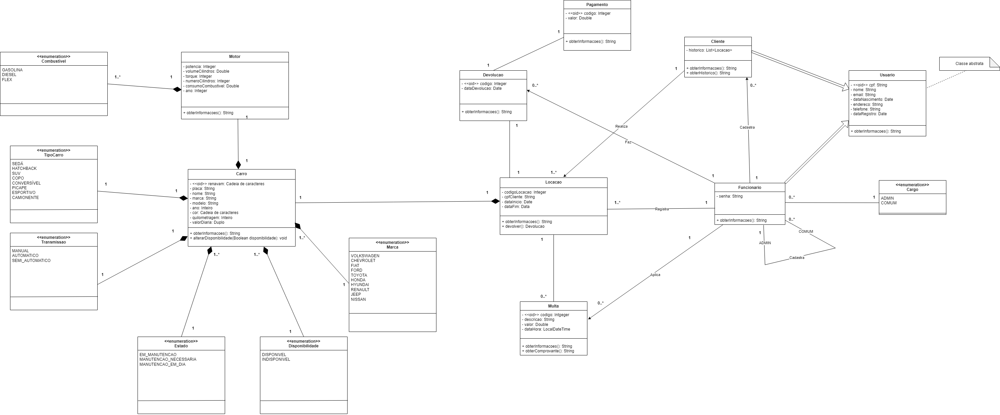

## Projeto Locadora de Veículos

## Sobre o Projeto
Este projeto foi desenvolvido em grupo como parte da disciplina de Programação Orientada a Objetos II e serviu como uma das avaliações do curso. 
O sistema simula operações comuns em uma locadora de veículos, com foco exclusivo em carros para simplificar o escopo do desenvolvimento. 
As funcionalidades implementadas incluem o cadastro de novos carros, a adição de funcionários e clientes, locação de veículos, devolução, aplicação de multas, entre outras.

## Requisitos do Projeto
- Implementação de **dois padrões de projetos estruturais.**
- Implementação de **dois padrões de projetos comportamentais.**
- Implementação de **dois padrões de projetos criacionais.**
- Conformidade com o diagrama de classes desenvolvido na disciplina de Análise e Projeto Orientado a Objetos.

## Diagrama de Classes

## Responsabilidades no Projeto
Como o projeto foi realizado em equipe, as tarefas foram distribuídas entre os membros. 
Minha responsabilidade incluiu a definição da arquitetura do sistema (Arquitetura em Camadas) e a implementação de diversos padrões de projeto, como Builder, Singleton, Template Method e Facade. 
Além disso, atuei como um suporte técnico para os demais integrantes durante o desenvolvimento do projeto.
